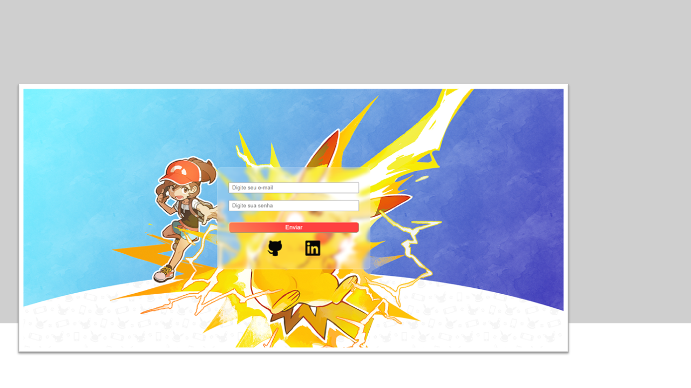

# Tela de Login

## Sobre o projeto
Projeto de estudo elaborado de uma página de Login de Usuário utilizando Javascript + CSS + HTML. O usuário deve informar um e-mail e senha válidos, do contrário, receberá um alerta.

Usuário: jogador@poke.com
Senha: 123456

## Tecnologias

- HTML
- CSS
- Javascript
- Git e Github

## Contato

emidio.daniel@hotmail.com

